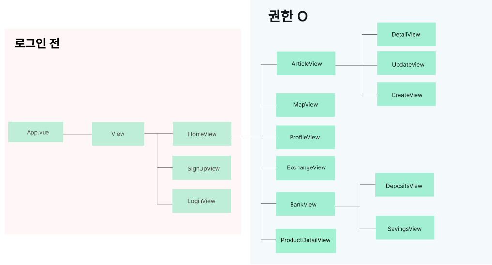
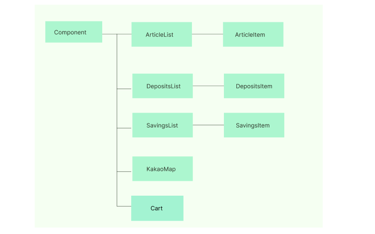
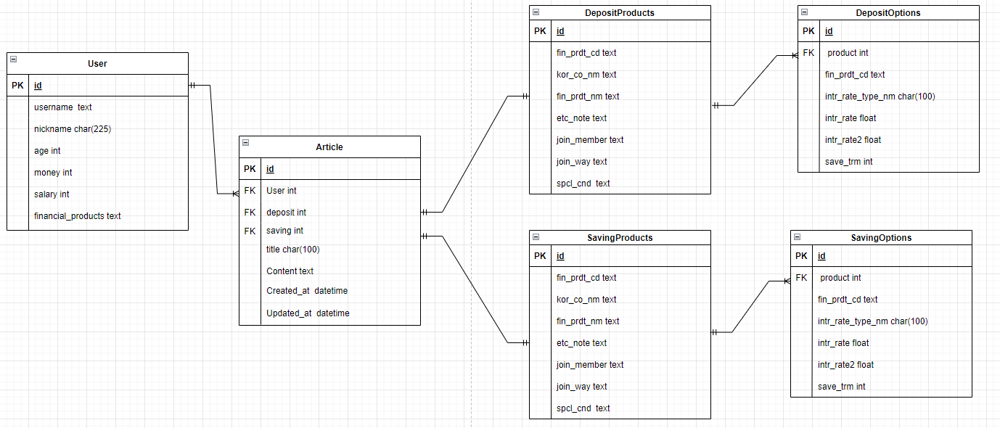

# Final Project - README
## 1. 팀원 정보 및 업무 분담 내역

### 1. 팀원 구성

- 팀장: 권원영
- 팀원: 김민규


### 2. 업무 분담 내역

- **권원영(팀장)**
  1. 내 주변 은행 검색
  2. component 및 view 구조 설계
  3. 금융상품 비교 및 관심목록 추가 기능
- **김민규(팀원)**
  1. 데이터 모델 구성
  2. 회원 커스터마이징 (회원가입, 로그인, 로그아웃 등)
  3. 추천 알고리즘 구현 및 출력
- **공통**
  1. 추천 목록 담기(장바구니) 및 상품 가입 
  2. 환율 계산기
  3. 프로필 화면 구성


## 2. 설계 내용(아키텍처 등) 및 실제 구현 정도

- **View**
  
  - **HomeView**:  App.vue의 직계자식 컴포넌트
    - 현재 로그인이 되어있는지(Token값이 있는지)에 따라 다른 화면 구성
    
  - **SignView** : 회원가입 컴포넌트
    - 사용자의 입력 데이터를 받아 DB에 저장 후, 회원가입이 완료될 시 로그인 진행 후 HomeView로 이동
    
  - **LoginView** : 로그인 컴포넌트
    - DB에 저장된 user 데이터 정보 중, 사용자 입력 username과 password를 비교하여 맞는 데이터 정보를 불러온 후 
    - 로그인이 완료된 경우, Token 값을 부여한 후 HomeView로 이동
    
  - **ArticleView** : 게시글 컴포넌트 
    - **DetailView** : 게시글 자세히보기 컴포넌트
    - **UpdateView** : 로그인한 유저와 게시글 작성자가 같을 경우, 해당 게시글을 수정할 수 있는 컴포넌트
    - **CreateView** : 로그인한 유저가 게시글을 작성할 수 있는 컴포넌트
    
  - **MapView** : 지도 컴포넌트
    - 카카오맵 API를 이용하여 구현한 지도
    - 검색어를 입력하면, 입력한 검색어를 바탕으로 가장 근접한 데이터 추출 
    
  - **ProfileView** : 로그인된 사용자 프로필 컴포넌트
    - 로그인 후 토큰을 부여받은 사용자에 대한 정보 조회 가능
    - 사용자 본인의 정보 확인 페이지
      - 금융상품 관심리스트 조회 및 신청, 삭제 가능
      - 신청한 금융상품 해지 가능
  - **ExchangeView** : 나라별 환율 계산 컴포넌트
    - 한국수출입은행 Open API에서 발급받은 API_KEY를 바탕으로 하여 각 나라별 환율정보를 통해 계산된 결과 출력

  - **BankView** : 금융상품정보 관련 컴포넌트
    - **DepositView** : 정기예금 금융상품정보 관련 컴포넌트
    - **SavingView** : 정기적금 금융상품정보 관련 컴포넌트

  - **ProductDetailView** : 금융상품정보에 대한 상세정보 컴포넌트
    - 기존 BankView에서보다 자세한 정보 확인 가능


- **Component**
  
  - **ArticleList - ArticleItem** : DB의 articles 테이블에 저장된 데이터들을 나열하여 조회하게끔 하는 컴포넌트 
    - ArticleList에서 각 article별로 ArticleItem에 대한 반복 
    - ArticleItem에서 게시글 작성자(사용자의 닉네임), 게시글 제목, 게시글 내용 등 확인 가능
    - 만약 조회하고 있는 대상이 게시글 작성자와 같은 경우, 해당 게시글 수정 및 삭제 버튼 활성화
  - **DepositList - DepositItem** : DB의 deposit_products deposit_options 테이블의 데이터들을 나열하여 조회하게끔 하는 컴포넌트,
    - 두 테이블을 연결시켜주는 필드 : deposit_products 테이블의 fin_prdt_cd(금융 상품 코드)

  - **KakaoMap** : 카카오맵 API를 활용하여 구성한 컴포넌트
    - 검색어 기능을 추가하여 사용자 입력 값에 대한 결과 장소 선정 및 출력
  - **Cart** : 관심상품 목록에 추가하기 위한 컴포넌트
    - LocalStorage를 활용하여 장바구니 기능을 활용한 구현


- **구현에 실패한 내용**
  - Comment : 각 게시글 별로 작성되는 댓글들에 대한 구현 실패
    - Comment 모델 구현 시, user, article을 FK로 지정
    - CommentSerializer 구현을 통한 JSON Response 실패
      - 이로 인한 CRUD 구현에 차질
      - 프로젝트 이후 논의 예정


## 3. 데이터베이스 모델링(ERD)



1. **accounts_user 테이블** 
  - 기존에 존재하던 User 모델이 아닌 Custom User 모델 정의
  - 나이, 자산, 연봉 별로 사용자에 대한 금융 상품 추천을 위해 age, money, salary 필드 생성
  - 사용자들의 아이디를 겹치지 않게 하기 위해 username 값에 unique 부여
  - 해당 사용자가 가입한 금융상품 코드를 알기 위해 financial_products 필드 생성
    - 사용자가 가입한 금융상품 코드는 각각 쉼표(,)로 구분하여 저장
2. **articles_article 테이블**
  - accounts_user 테이블과 1:N 관계를 맺기 위해 외래키로 user 지정
    - 게시글을 작성한 사용자 정보가 DB에서 사라질 경우를 대비하여 "on_delete=models.CASCADE" 지정 
  - 게시글의 제목, 내용 등을 담아둔 title, content 필드 생성
  - 어떤 유형의 금융상품에 대한 게시글인지 확인을 위해 DepositProducts 모델, SavingProducts 모델로부터 외래키를 활용한 deposit, saving 필드 생성
    - 하나의 게시글은 deposit과 saving 둘 중한 필드값은 반드시 null이기에, "null=True" 지정
3. **financial_products_depositproducts -> financial_products_depositoptions 테이블**
  - depositproducts : 예금 금융 상품 정보 테이블
  - depositoptions : 예금 금융 상품 옵션 테이블(하나의 상품에 여러 개의 옵션 존재 가능)
    - 두 테이블은 공통된 필드 값 'fin_prdt_cd'를 갖기에, 이를 depositoptions의 FK로 지정
4. **financial_savings_savingproducts -> financial_products_savingoptions 테이블**
  - savingproducts : 적금 금융 상품 정보 테이블
  - savingoptions : 적금 금융 상품 옵션 테이블(하나의 상품에 여러 개의 옵션 존재 가능)
    - 두 테이블은 공통된 필드 값 'fin_prdt_cd'를 갖기에, 이를 savingoptions의 FK로 지정

- 위의 3, 4번에서 설명한 테이블들은 금융상품 통합 비교공시 API를 통해 활용


## 4. 금융 상품 추천 알고리즘에 대한 기술적 설명

1. **비슷한 나이대의 사용자 추천**
  - 추천 방식 : 위아래 3살 범위에서 가장 많이 가입한 상위 5개의 금융 상품 추천
    - DB에서 현재 로그인한 사용자로부터 정보를 받아, 사용자의 나이를 기준으로 하여 쿼리셋 조회
    - 해당 쿼리셋에 포함된 유저객체들로부터 가입한 금융상품들의 개수를 세어, 가장 많이 가입한 상위 5개의 금융상품정보 반환
    - 반환 시, 해당 쿼리셋 내에서 각 상품별로 가입한 사람의 수를 함께 반환

2. **비슷한 자산의 사용자 추천**
  - 추천 방식 : 본인 자산의  95% ~ 105% 수준의 사용자들 중 가장 많이 가입한 상위 5개의 금융 상품 추천
    - DB에서 현재 로그인한 사용자로부터 정보를 받아, 사용자의 자산(데이터값 : 10000원 단위)을 기준으로 하여 쿼리셋 조회
    - 해당 쿼리셋에 포함된 유저객체들로부터 가입한 금융상품들의 개수를 세어, 가장 많이 가입한 상위 5개의 금융상품정보 반환
    - 반환 시, 해당 쿼리셋 내에서 각 상품별로 가입한 사람의 수를 함께 반환

3. **비슷한 연봉의 사용자 추천**
  - 추천 방식 : 본인 연봉의 95% ~ 105% 수준의 사용자들 중 가장 많이 가입한 상위 5개의 금융 상품 추천
    - DB에서 현재 로그인한 사용자로부터 정보를 받아, 사용자의 연봉(데이터값 : 1원 단위)을 기준으로 하여 쿼리셋 조회
    - 해당 쿼리셋에 포함된 유저객체들로부터 가입한 금융상품들의 개수를 세어, 가장 많이 가입한 상위 5개의 금융상품정보 반환
    - 반환 시, 해당 쿼리셋 내에서 각 상품별로 가입한 사람의 수를 함께 반환


## 5. 서비스 대표 기능들에 대한 설명

1. **예적금 상품 비교**
  - 은행별로 다양한 예금 및 적금 상품들이 존재한다. 이를 한 눈에 볼 수 있게끔 예금별, 적금별 금융 상품 리스트를 구현했다. 또한, 해당 상품의 이름을 클릭하면 더 자세한 정보를 조회할 수 있게끔 구현했다.

2. **근처 은행 검색:  검색어**
  - 사용자가 본인 근처의 은행을 찾고자 할 때, 검색을 통해 본인과 가까운 은행의 위치를 찾아볼 수 있도록 검색 기능을 구현하였다. 기존에는 여러가지 항목을 세팅한 후 사용자가 선택하면 결과가 나오게 구성하였지만, 사용자들의 자율성을 위해 직접 검색을 통해 보다 더 자세하고 가까운 은행을 조회할 수 있게 했다.

3. **프로필 - 관심목록/상품가입 및 해지 기능**
  - 사용자들이 본인의 프로필을 통해 과거에 관심있게 본 금융상품목록들을 따로 볼 수 있고, 해당 상품들을 신청할 수 있게끔 프로필을 구현했다. 또한, 본인이 가입한 상품들 중 해지할 경우, 클릭을 통해 DB를 조작하여 해당 상품을 사용자의 필드 값에서 제거할 수 있도록 했다.
4. **게시판**
  - 사용자들이 특정 금융상품에 대한 정보, 장/단점에 대해 직접 사용한 사람들로부터 자세하게 알 수 있도록 게시판 커뮤니티를 구현했다. 어떠한 사용자가 어떤 금융상품을 신청했는지, 해당 금융상품을 통해 어떠한 결과를 얻게 되었는지 등 사용자들이 게시판을 통해 자유롭게 정보전달을 할 수 있게끔 도왔다.

5. **회원가입 및 로그인/로그아웃**
  - 기존에 생성한 accounts 앱의 User 모델에 각 사용자별 데이터를 저장 및 조회하는 방식으로 해당 기능을 구현했다. 회원가입을 통해 DB에 전달받은 데이터를 저장하고, 로그인 시 DB를 조회하며 로그인 대상자가 존재하는 경우 토큰을 부여하였다. 이러한 방식을 통해 사용자는 자유롭게 회원가입 및 로그인/로그아웃을 할 수 있게끔 구현하였다.
6. **환율계산기** 
  - 환율 계산기는 한국수출입은행 Open API에서 발급받은 API_KEY를 사용했다. 다만, 매일 환율이 변동할 수 있기 때문에, 다음과 같은 코드를 사용하여 날짜별로 업데이트 될 수 있도록 하였다.
  ```python
  # 현재 날짜를 YYYYMMDD 형식의 문자열로 가져오기
  current_date = datetime.now().strftime("%Y%m%d")
  ```
  - 각 국가별 지정 코드, 국가별 환율 최대, 최소, 평균 값, 국가별 돈의 단위 등을 담고있는 데이터에서 우리는 평균 값을 환율을 위한 데이터로 활용하였다. 다만, 기록된 해당 데이터가 100단위인지 혹은 1단위인지를 알기 위해 국가별 지정 코드에 단위(unit)값을 붙여서 반환했다. 이를 활용하여 사용자가 국가를 선택한 후, 해당 국가의 단위별 금액을 선택하면 이는 한국 돈으로 얼마가 되는지를 출력해주는 시스템을 구현했다.


## 6. 기타(느낀 점, 후기 등)

**권원영**

: 먼저 7월부터 지금까지 해왔던 이론 학습과는 전혀 결이 달랐다. 그렇지만 왜 우리가 7월부터 지금까지 이론을 열심히 해왔는지도 느낄수 있었다. 프로젝트를 수행할 때 가장 중요하다고 느낀 부분은 바로 **설계** 부분이다. 가장 먼저 우리 프로젝트의 목표를 생각하며 우리가 활용할 **데이터(Backend)**, 보여줄 화면(HTML), 그리고 **그 화면들을 넘나들 수 있는 로직(JavaScript)** 모든 것을 코드 한 줄 써보기도 전에 생각을 하면서 모델의 구조도, 화면의 구조도, 그리고 그 구조를 연결시켜주는 로직을 구성해야 했던 점이 가장 어려웠다. 

 하지만 그렇게 시작한 설계가 우리가 총 7일 간의 프로젝트를 수행할 때의 길잡이가 되주었다. 이 설계를 통해서 모든 일정을 구성할 수 있었다. 이를 통해 비록 2명이었지만 나와 김민규 팀원 간의 역할 분배도 할 수 있었고 일정에 따른 업무 부여가 가능했던 것도 설계 단계에서 치열하게 고민했기 때문이라고 생각한다. 결코 우리의 프로젝트 퀄리티가 좋다고 할 순 없지만 우리가 프로젝트를 진행하는 동안은 운이 좋게도 갈피를 못잡거나 한쪽에 너무 치우쳐서 다른 부문을 신경쓰지 못하게 되는 시행착오를 피할 수 있었다. 

 그렇지만 이 모든 것을 가능하게 한 전제는 팀이 하나가 되어서 움직이고 팀원의 나에 대한 신뢰, 나의 팀원에 대한 신뢰가 있어야 한다는 것이다. 하루를 불가피하게 예비군 훈련으로 빠지게 되었는데 그 공백을 잘 메꿔준 김민규 팀원에게 고맙다. 이상 끝.

 

**김민규** 

: 프로젝트의 전반적인 과정에서 아이디어 및 구현에 대한 구상의 비율이 굉장히 크다고 느꼈다. 백엔드 부분에서 어떠한 기능을 담당하는 앱들이 필요한지, DB의 테이블들은 어떤 필드들로 구성되고, 각 테이블간의 관계를 어떻게 정의해야 할 지 등등, 프론트엔드 부분에서 컴포넌트의 구성은 어떻게 되는지, 어떠한 형태를 유지하며 보여줄지에 대한 고민을 많이 했던 것 같다. 이 과정에 시간을 많이 투자하게 된 결과, 중간에 자잘한 에러가 발생한 경우는 많았으나, 처음부터 다시 시작해야 하는 경우는 없었다. 그만큼 초반에 설계하는 것이 개발자의 개발 단계에서 엄청난 중요도를 가지고 있다는 것을 알게 되었다. 다만, 그동안 배워왔던 것을 단 일주일 만에 하나의 프로젝트에서 활용하려니 생각보다 많이 힘들었다. 그만큼 내가 당시 알고 있다고 생각하고 지나쳤던 것들이 사실은 이해가 되지 않고 경험이 부족한 것들이라는 생각이 든다. 하지만 이 과정에서 공식문서들을 많이 참고하며 앞으로 이런 일이 있을 때 대처하는 방안을 알게 되었다.